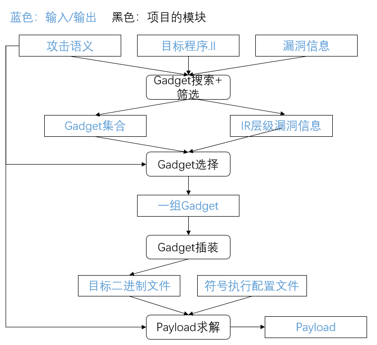

# DOP
项目由于某些原因，不能开源。

# 简介
- 工作的目的：向目标程序中构建隐秘通道，并自动化的完成利用过程。自动化过程分为4个阶段：Gadget搜索、Gadget选择和组织，插装，自动化求解payload。    
- 搜索模块：使用llvm pass框架对程序进行静态分析，并根据攻击语义筛选搜索出来的可能可以使用的Gadget。
- 选择和组织：根据Gadget自身的特征和语言，以及攻击语义/攻击目的，对Gadget的易用性进行评价并排序，选择出比较容易攻击成功的一组Gadget。
- 插装：使用llvm pass框进行静态插装，如果没能找到一组完整的Gadget来完成攻击语义中描述的攻击目的，就对缺失的Gadget类型进行插装，同时也不影响程序原本的功能。
- 求解payload：根据攻击语义、Gadget组合的选择，利用符号执行技术对攻击过程中的攻击路径进行探索，并对payload进行自动化求解。

# 项目整体情况
